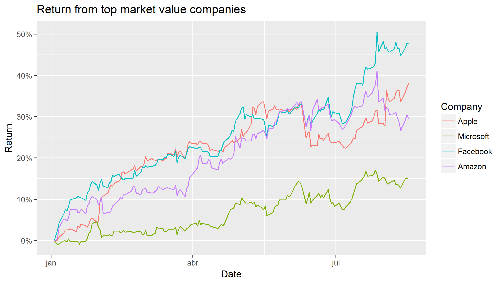

A Comparison over time of the ROI of top 4 Companies
========================================================
author: Marcelo Angelo Pita
date: 17/08/2017
autosize: true


Overview
========================================================

A Web page was developed using **Shiny** to build an interactive way to compare the Return Over Investment (ROI) of the top 4 companies at the S&P500 index. The companies are:

- *Apple*
- *Microsoft*
- *Facebook*
- *Amazon*

You can choose the starting and ending date, and the return of each of the companies will be calculate. The chart of this evolution will be plotted at the page.

How it was done
========================================================

It was used the **quantmod** package for downloading the stock price information.


```r
start <- as.Date("2017-01-01")
end <- Sys.Date()
companies <- c("AAPL", "MSFT", "FB", "AMZN")
getSymbols(companies, src = "yahoo", from = start, to = end)
```

```r
str(as.data.frame(AAPL))
```

```
'data.frame':	157 obs. of  6 variables:
 $ AAPL.Open    : num  117 117 117 118 119 ...
 $ AAPL.High    : num  118 118 118 120 121 ...
 $ AAPL.Low     : num  116 117 117 118 119 ...
 $ AAPL.Close   : num  116 116 117 118 119 ...
 $ AAPL.Volume  : num  28781900 21118100 22193600 31751900 33561900 ...
 $ AAPL.Adjusted: num  115 115 115 116 118 ...
```


Example Chart
========================================================

From the received data, some transformations are made to give the return with the base value been the one on starting date.
As example, here is the plot of the ROI of each company this year until today:





Try it!
========================================================

Go to the web page and try it yourself!

https://marceloangelopita.shinyapps.io/dataproductfinalproject/ 
